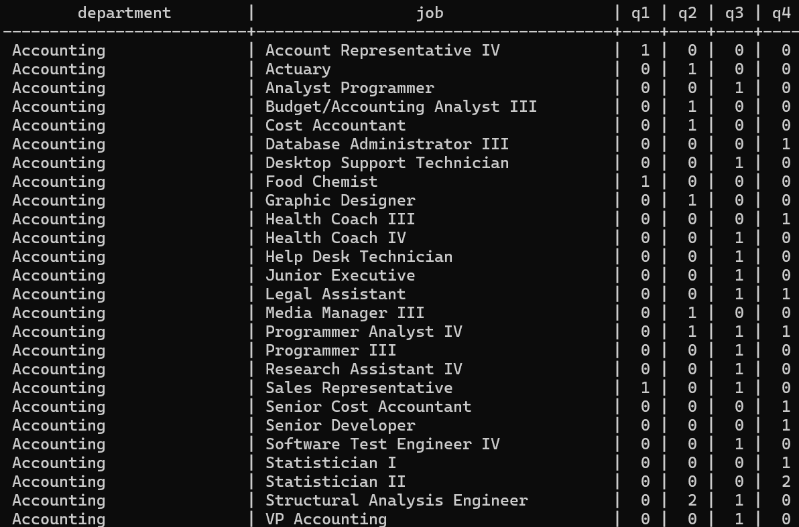
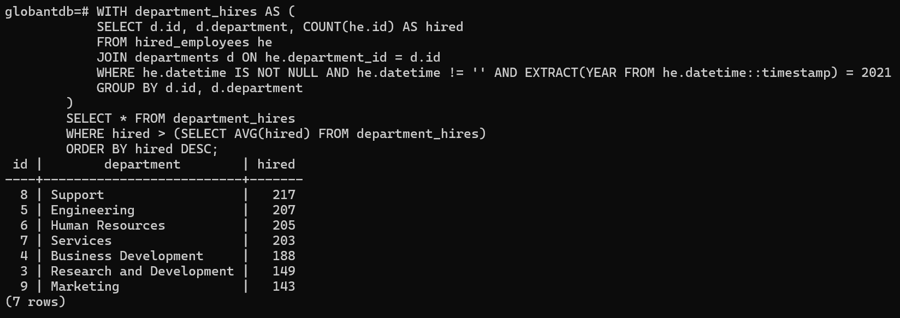

## Setup Instructions

1. Clone the repository:
    ```bash
    git clone https://github.com/sgogaleano/GlobantDataChallenge.git
    cd GlobantDataChallenge
    ```

2. Run the setup script:
    ```bash
    chmod +x 00_setup_environment.sh
    ./00_setup_environment.sh
    ```

3. Place your CSV files in the [Data](http://_vscodecontentref_/2) directory.

4. Load the CSV data into the database:
    ```bash
    python3 01_loadCSVtoDB.py
    ```

5. Build the Docker image:
    ```bash
    docker build -t globantdatachallenge .
    ```

6. Run the Docker container:
    ```bash
    docker run -p 8000:8000 globantdatachallenge
    ```

7. Run the FastAPI server (if not using Docker):
    ```bash
    uvicorn 02_apiRest:app --reload
    ```

## Requirements

- Python 3
- PostgreSQL
- Docker (optional, if you want to use Docker)
- Required Python packages (listed in requirements.txt)

## API Endpoints

### Batch Insert
- **URL:** `/batch_insert/`
- **Method:** `POST`
- **Description:** Batch insert departments, jobs, and employees.
- **Request Body:**
    ```json
    {
        "departments": [
            {"id": 1, "department": "HR"}
        ],
        "jobs": [
            {"id": 1, "job": "Manager"}
        ],
        "employees": [
            {"id": 1, "name": "John Doe", "datetime": "2023-01-01T00:00:00", "department_id": 1, "job_id": 1}
        ]
    }
    ```

## Backup and Restore

### Backup Tables
- **Script:** [03_avroBackup.py](http://_vscodecontentref_/3)
- **Description:** Backs up all tables to Avro files in the [backups](http://_vscodecontentref_/4) directory.

### Restore Tables
- **Script:** [04_restoreTableFromBackup.py](http://_vscodecontentref_/5)
- **Description:** Restores a table from an Avro backup file.

## Challenge 2

### Numeral A:
- Number of employees hired for each job and department in 2021 divided by quarter. The table must be ordered alphabetically by department and job.
- **Script:** [05_apiChallenge2_A.py](http://_vscodecontentref_/6)
- **Start FastAPI application:** `uvicorn 05_apiChallenge2_A:app --reload`
- **To execute from terminal:** `curl -X GET "http://127.0.0.1:8000/employees_per_quarter/"`


### Numeral B:
- List of ids, name and number of employees hired of each department that hired more employees than the mean of employees hired in 2021 for all the departments, ordered by the number of employees hired (descending).
- **Script:** [05_apiChallenge2_B.py](http://_vscodecontentref_/7)
- **Start FastAPI application:** `uvicorn 05_apiChallenge2_B:app --reload`
- **To execute from terminal:** `curl -X GET "http://127.0.0.1:8000/hired_more_than_mean/"`
